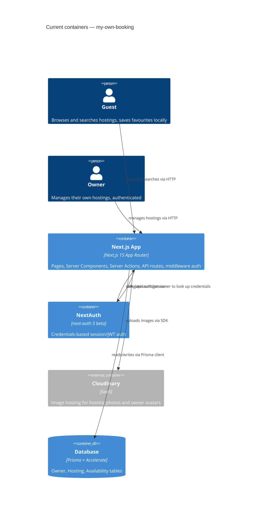

# Architecture map — my-own-booking

> The **current** architecture (what exists today), produced by `survey` and read by
> specify / design / data-model / implement. Refresh with `survey` when the repo drifts past
> `reflects_commit`. This is generated; a hand-maintained `docs/architecture.md`, if present, is
> authoritative and reconciled below — not replaced.

## Stack

- Language / runtime: TypeScript 5.8.3, Node (`package.json:60`)
- Frameworks: Next.js 15.2.6 App Router (`package.json:34`), React 19 (`package.json:38`), Prisma 6.8.2 + Accelerate (`package.json:16-17`), NextAuth 5.0.0-beta.25 (`package.json:35`), Tailwind CSS 4 (`package.json:58`), Radix UI primitives (`package.json:18-24`)
- Build / test / lint:
  - build: `prisma generate --no-engine && next build` (`package.json:7`)
  - dev: `next dev --turbopack` (`package.json:6`)
  - lint: `next lint` (`package.json:9`)
  - test: none configured — no jest/vitest/playwright in devDependencies (`package.json:48-63`)
  - migrations: `prisma migrate` (implicit CLI; seed script at `package.json:12`)

## C4 — system as it is

## Module inventory

| Module | Path | Layers | Wired at | Responsibility |
|---|---|---|---|---|
| App Router pages | `src/app/` | presentation (server + client components) | `src/app/layout.tsx` | Routes, layouts, route groups (`(auth)`), dynamic pages for hostings/owner |
| API routes | `src/app/api/` | infra (HTTP handler) | `src/app/api/auth/get-owner/route.ts:1` | NextAuth credential lookup endpoint |
| Server Actions | `src/actions/` | application/domain | `src/actions/hosting-actions.tsx:1`, `src/actions/owner-actions.tsx:1` | Mutations: search, CRUD hostings, login/signup/logout |
| Components | `src/components/` | presentation | `src/components/search-form.tsx:1` | Client/server feature components (forms, cards, buttons) |
| UI primitives | `src/components/ui/` | presentation (design system) | `src/components/ui/button.tsx:1` | shadcn-style Radix-based primitives (Button, Card, Dialog, …) |
| lib | `src/lib/` | infra/domain support | `src/lib/prisma.ts:1`, `src/lib/auth.ts:1` | Prisma singleton, NextAuth config, validation (zod), server utils, types, constants |
| context | `src/context/` | presentation state | `src/context/owner-context.tsx:1` | Owner data React Context for owner-scoped pages |
| middleware | `src/middleware.ts` | infra | `src/middleware.ts:7` | Delegates route protection to NextAuth |
| prisma | `prisma/` | infra (data) | `prisma/schema.prisma:1` | Schema, generated client, seed script |

## Conventions (cited — the rules a new feature must match)

- **Module wiring / registration:** file-system routing via Next.js App Router; route groups for layout isolation — `src/app/(auth)/login/page.tsx`
- **Error handling:** server actions return `{message: string}` on failure, logged via `console.error` — `src/actions/hosting-actions.tsx:14-26`; API routes return `NextResponse` with status codes — `src/app/api/auth/get-owner/route.ts:9`
- **IDs:** autoincrement integer PKs; `slug` used for hosting URL routing — `prisma/schema.prisma:12,25-26,44`
- **Persistence / DB access:** Prisma client singleton with `server-only` guard, Accelerate extension — `src/lib/prisma.ts:1-6`
- **Migrations:** `prisma migrate` (CLI, not yet in package.json scripts) — `prisma/schema.prisma`
- **Tests:** none configured — UNKNOWN
- **Inter-module communication:** client components call Server Actions directly (react-hook-form + zod) — `src/components/search-form.tsx:36`; Server Components call server utils directly — `src/app/hosting/[slug]/page.tsx:18`
- **UI / styling (if a frontend exists):** Tailwind 4 utilities + CVA for variants, Radix UI primitives wrapped shadcn-style — `src/components/ui/button.tsx:7-36` (detail in §Frontend / UI foundation below)

## Datastores

| Store | Engine | Accessed via | Notes |
|---|---|---|---|
| Primary DB | Prisma-managed (engine unspecified by explorer) + Accelerate | `src/lib/prisma.ts` singleton | Models: Owner, Hosting, Availability (`prisma/schema.prisma`) |
| Image storage | Cloudinary (SaaS) | `src/lib/cloudinary.ts`, upload_stream in server actions | Folders: `hosting_photos`, `owners_avatars` |
| Client-local | Browser localStorage | `src/components/favourite-hostings-button.tsx:19-24` | Guest favourites, no server persistence |

## Frontend / UI foundation

- **Component library / design system:** in-repo shadcn-style primitives over Radix UI — `src/components/ui/`
- **Design tokens:** CSS variables in oklch() color space, light/dark theme blocks, `@theme inline` Tailwind mapping — `src/app/globals.css:6-112`
- **Styling approach:** Tailwind 4 utility classes + CVA for component variants; custom utility classes (`.common-btn`, `.main-container`) — `src/app/globals.css:1,127-166`; `src/components/ui/button.tsx:7-36`
- **Shared primitives:** Button, Card, Input, Label, Textarea, Avatar, Dialog, DropdownMenu, Popover, Separator, Carousel (Embla), Sonner toaster — `src/components/ui/`
- **State / data-fetching:** no client data-fetching library; Server Components + Server Actions + React Context (`owner-context.tsx`) for owner-scoped state; `unstable_cache()` for server-side read caching — `src/lib/server-utils.ts:22-110`
- **Closest UI precedent:** a new detail/listing screen looks like the hosting detail page — `src/app/hosting/[slug]/page.tsx:1-87`

## Where things live / closest precedents

- A new server-mutation feature (form → validation → DB write) → `src/actions/`, modelled on hosting CRUD (`src/actions/hosting-actions.tsx:56-158`), using zod schema in `src/lib/validations.ts`.
- A new authenticated owner-only page → `src/app/owner/`, modelled on the dashboard (`src/app/owner/dashboard/page.tsx:1-37`), gated by `checkAuth()` (`src/lib/server-utils.ts:12-20`) in the layout.
- A new public search/listing flow → `src/app/hostings/[place]/page.tsx`, modelled on existing filtered listing with Suspense (`src/app/hostings/[place]/page.tsx:1-45`).
- A new screen / UI component → composed from the existing design system (§Frontend), modelled on the hosting detail page (`src/app/hosting/[slug]/page.tsx:1-87`).

## Constraints & known tech-debt

- No test runner configured (no jest/vitest/playwright) — new features can't get automated test coverage until a harness is chosen; `plan-tests`/`implement` must pick and set one up.
- `prisma migrate` is not wired into `package.json` scripts — migration commands must be run via `npx prisma migrate ...` directly.
- NextAuth 5 is still in beta (`5.0.0-beta.25`) — auth-related API surface may change on upgrade.
- Favourites are client-only (localStorage) — no server-side persistence or sync across devices; a "real" favourites feature would need a schema change.
- Owner/Hosting/Availability use autoincrement int IDs, not UUIDs — any external-facing ID exposure should keep using `slug` for hostings, not raw ints.

## Reconciliation with the authored architecture doc

No authored architecture doc (`docs/architecture.md`, `ARCHITECTURE.md`, root `CLAUDE.md`) or ADRs found in the repo; this map is the current reference.
