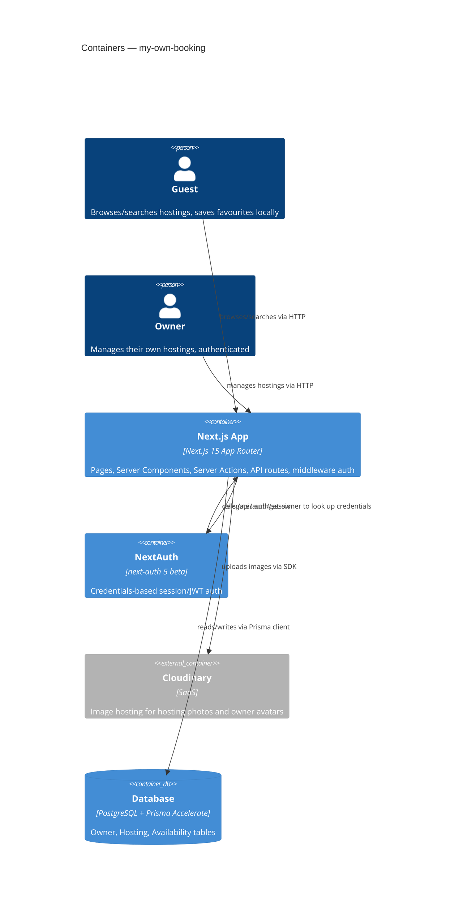
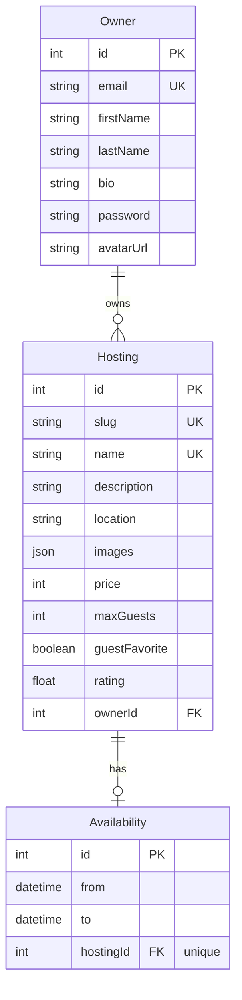

# Architecture — my-own-booking (CozyPlaces)

Hand-authored project documentation. Complements the machine-generated
`docs/architecture-map.md` (produced by the repo's `sdd:survey` tooling) — this file is the
authoritative source when the two disagree.

## Overview

CozyPlaces is a two-sided booking/listings app:

- **Guests** (anonymous) search hostings by city, guest count, and date range, view hosting
  details, and save favourites to `localStorage` (no account required).
- **Owners** authenticate (email/password via NextAuth credentials), and manage their own
  hostings — create, edit, delete, with photo uploads.

## Tech stack

| Layer | Choice |
|---|---|
| Framework | Next.js 15, App Router, Turbopack in dev |
| UI | React 19, Tailwind CSS 4, Radix UI primitives wrapped shadcn-style, CVA for variants |
| Data | PostgreSQL, Prisma 6 ORM + Prisma Accelerate extension |
| Auth | NextAuth 5 (beta), credentials provider, JWT session strategy |
| Images | Cloudinary (upload + hosting), rendered via `next/image` |
| Forms | react-hook-form + zod |
| Animation | framer-motion (header mobile menu) |

## System diagram

## Data model

Notes:
- All primary keys are autoincrement integers; `Hosting.slug` is the public-facing identifier
  used in URLs (`/hosting/[slug]`) — never expose raw integer IDs externally.
- `Hosting.images` is a JSON array of Cloudinary URLs (or legacy local asset paths handled by
  `changeImageUrl()` in `src/lib/utils.ts`).
- Indexes: `Hosting.ownerId`, `Hosting.location`, `Hosting.maxGuests` (added for search/filter
  performance — see `docs/optimization-plan.md`).
- No migration history is currently committed (`prisma/migrations` doesn't exist); the schema is
  applied via `prisma db push`. Adopting `prisma migrate` is tracked as tech debt below.

## Module map

| Module | Path | Responsibility |
|---|---|---|
| App Router pages | `src/app/` | Routes, layouts, route groups (`(auth)`), dynamic pages for hostings/owner |
| API routes | `src/app/api/` | `GET/POST /api/auth/get-owner` — NextAuth credential lookup |
| Server Actions | `src/actions/` | Mutations: search, hosting CRUD, login/signup/logout |
| Components | `src/components/` | Feature components (forms, cards, buttons) |
| UI primitives | `src/components/ui/` | shadcn-style Radix-based design system |
| lib | `src/lib/` | Prisma client singleton, NextAuth config, zod validation, server utils, constants |
| context | `src/context/` | `OwnerDataProvider` — owner + their hostings, scoped to `/owner/*` |
| middleware | `src/middleware.ts` | Delegates route protection to NextAuth (`config.matcher` excludes `api`, `_next/static`, `_next/image`, `favicon.ico`) |
| prisma | `prisma/` | Schema, generated client (`prisma/app/generated/prisma-client`) |

## Key flows

### Search
`SearchForm` (client) → `searchHosting` server action validates + redirects to
`/hostings/[place]?city=&guests=&startDate=&endDate=` → `HostingsList` (server component) calls
`getHostings()` (Prisma query, `unstable_cache`-wrapped, tag `get-hostings`) → paginated
(`take: 6`) results rendered as `HostingCard`s.

### Auth
`next-auth` credentials provider → `authorize()` calls `POST /api/auth/get-owner` (internal HTTP
round-trip, not a direct DB call) → bcrypt-compares password → JWT callback stores `ownerId` on
the token → session callback exposes it as `session.user.id` (typed via `src/next-auth.d.ts`).
`checkAuth()` in `src/lib/server-utils.ts` gates owner-only pages/actions.

### Owner hosting CRUD
`HostingForm` (client) → `addNewHosting` / `editHosting` / `deleteHosting` server actions
(`src/actions/hosting-actions.tsx`) → `checkAuth()` + ownership check
(`hosting.ownerId !== session.user.id`) → image files uploaded to Cloudinary via
`upload_stream` → `prisma.hosting.create/update/delete` + `prisma.availability.create/update` →
`revalidatePath('/owner/dashboard')` + `revalidateTag('get-hostings')`.

### Favourites
Client-only: `FavouriteHostingsButton` stores hosting IDs in `localStorage`
(`favouriteHostings` key). `FavouriteHostingsList` reads the IDs on mount and calls
`fetchFavouritesByIds` (server action) to hydrate full hosting records. No server-side
persistence — favourites don't sync across devices.

## Conventions

- **Error handling:** server actions return `{ message: string }` on failure (logged via
  `console.error`); API routes return `NextResponse` with status codes.
- **IDs:** autoincrement integers; `slug` for hosting URLs.
- **Persistence:** Prisma client singleton with `server-only` guard + Accelerate extension
  (`src/lib/prisma.ts`).
- **Data fetching:** Server Components + Server Actions; `unstable_cache()` for server-side read
  caching, tag-based invalidation (`revalidateTag`) on mutation.
- **Styling:** Tailwind utility classes + CVA for variants; design tokens as CSS variables in
  oklch() color space (`src/app/globals.css`).
- **Tests:** none configured yet (no jest/vitest/playwright).

## Known limitations / tech debt

- No test runner configured — no automated coverage.
- No `prisma/migrations` history; schema changes are applied via `db push`, which doesn't produce
  a reviewable/rollback-able migration trail.
- NextAuth 5 is still in beta — auth API surface may change on upgrade.
- Favourites are client-only (`localStorage`) — no account-linked persistence.
- `package.json` references a `prisma db seed` script (`prisma.seed` field) pointing at
  `prisma/seed.ts`, but that file doesn't currently exist in the repo.
- The installed Prisma CLI is `6.8.2`; some editor tooling may already assume Prisma 7's
  `prisma.config.ts` conventions (cosmetic mismatch today — see
  [`docs/optimization-plan.md`](docs/optimization-plan.md) §7).
- See [`docs/optimization-plan.md`](docs/optimization-plan.md) for tracked performance work
  (query patterns, image delivery, caching, bundle size, dependency hygiene).

## Related docs

- [`README.md`](../README.md) — setup, scripts, environment variables
- [`docs/optimization-plan.md`](optimization-plan.md) — optimization backlog and status
